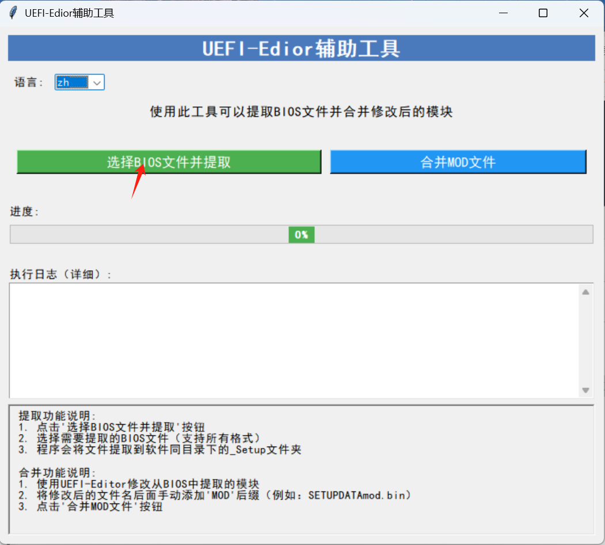
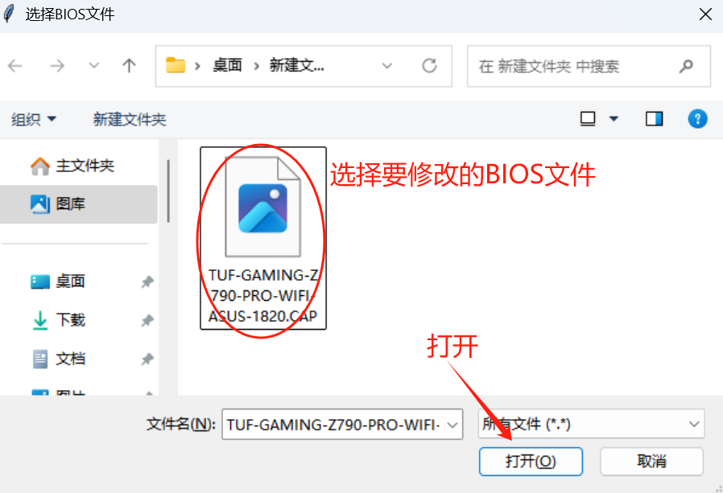
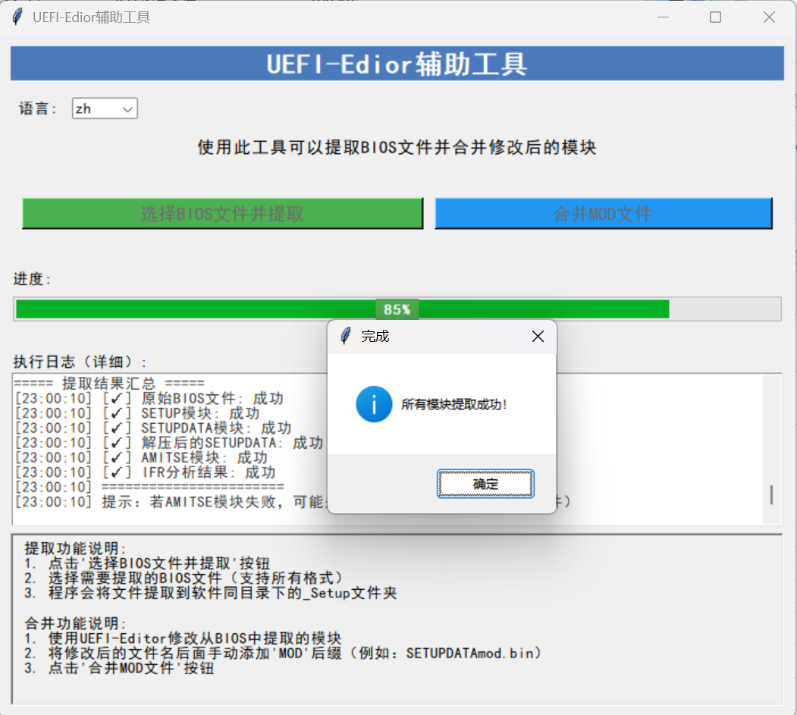
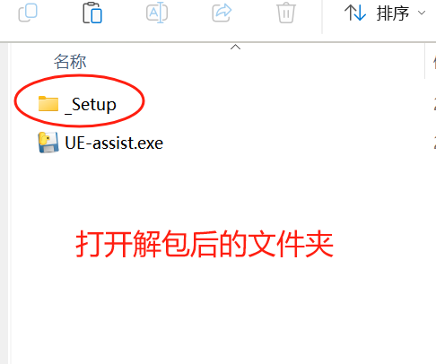
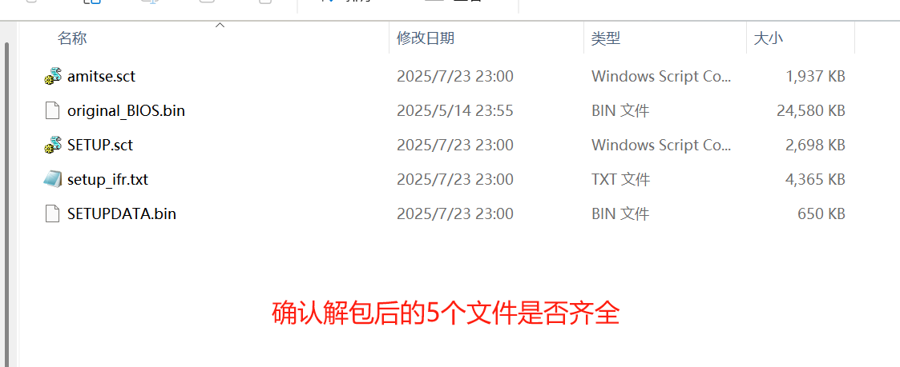
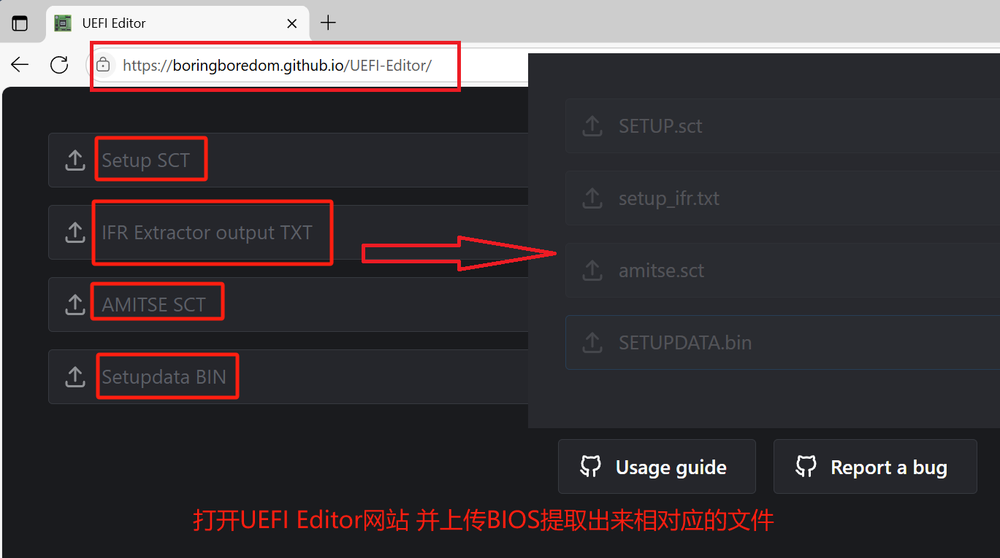
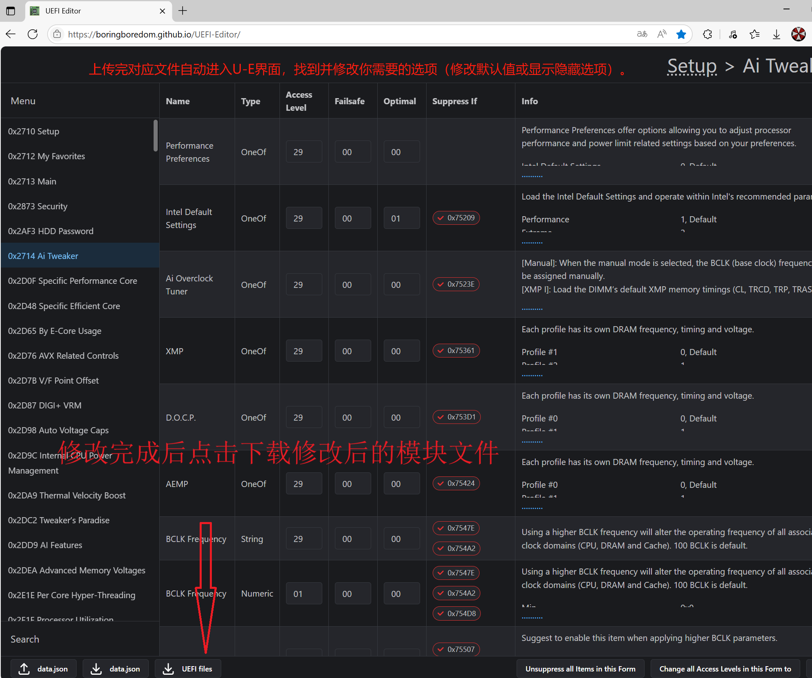
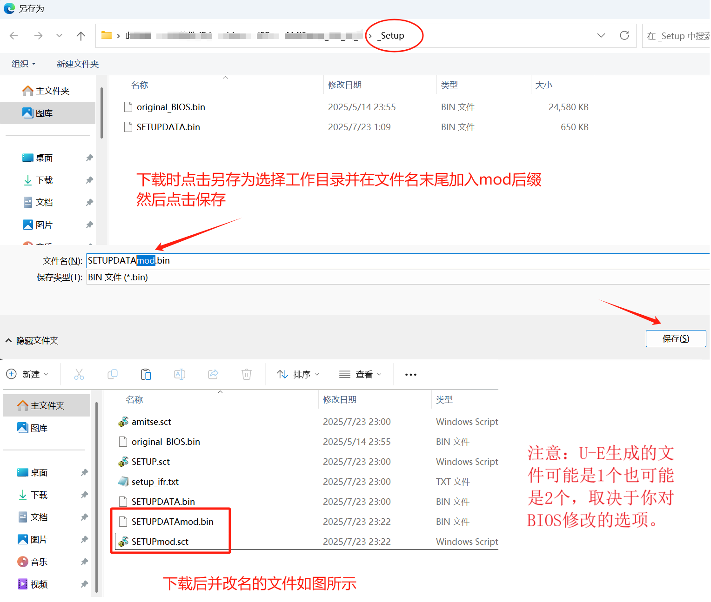
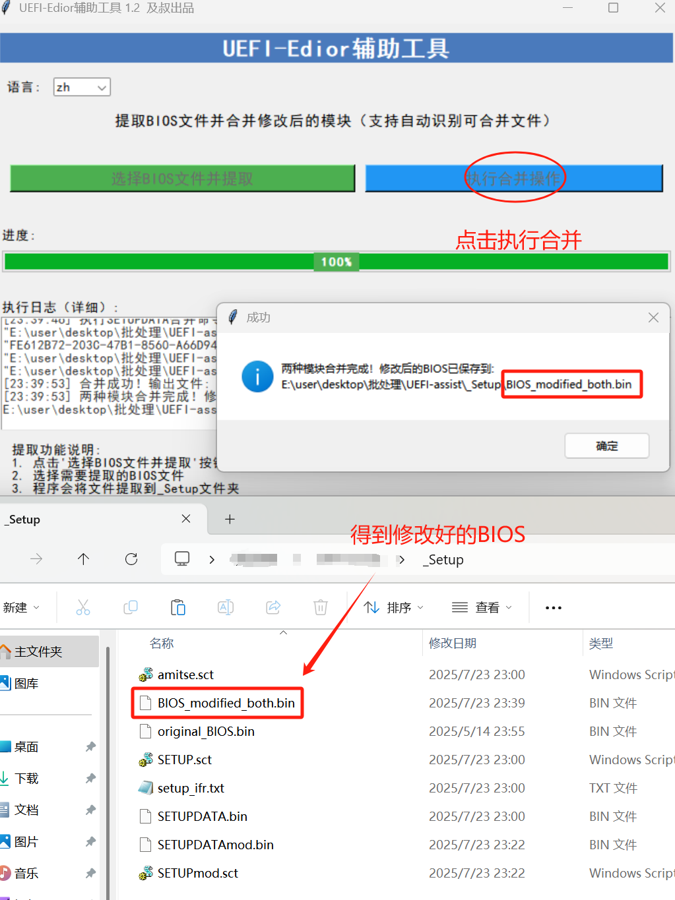

# UEFI-Edior辅助工具使用教程

## 一、前期准备（Preparations）
确保电脑已正确安装相关依赖环境（若有），准备好需要修改的BIOS文件（如示例中的 `TUF - GAMING - Z790 - PRO - WIFI ASUS - 1820.CAP` 这类文件 ）。  
Ensure the relevant dependency environment (if any) is properly installed on your computer. Prepare the BIOS file you need to modify (such as the file like `TUF - GAMING - Z790 - PRO - WIFI ASUS - 1820.CAP` in the example).  

## 二、BIOS文件提取（Extracting the BIOS File）
### 2.1 启动软件（Launch the Software）  
运行 `UEFI - Edior辅助工具`，界面显示“选择BIOS文件并提取”和“合并MOD文件”按钮。  
Run the `UEFI - Edior Assistant Tool`. The interface will display two buttons: *Select BIOS File and Extract* and *Merge MOD Files*.  

  

### 2.2 选择BIOS文件（Select the BIOS File）  
点击“选择BIOS文件并提取”按钮，在弹出的文件选择窗口中，找到并选中要修改的BIOS文件（如 `TUF - GAMING - Z790 - PRO - WIFI ASUS - 1820.CAP` ），点击“打开”。  
Click the *Select BIOS File and Extract* button. In the pop - up file selection window, locate and select the BIOS file you want to modify (e.g., `TUF - GAMING - Z790 - PRO - WIFI ASUS - 1820.CAP`), then click *Open*.  

  

### 2.3 等待提取完成（Wait for Extraction to Complete）  
程序开始提取BIOS文件相关模块，进度条会显示提取进度。提取完成后，会弹出“所有模块提取成功！”提示框，点击“确定”。同时，软件同目录下会生成 `_Setup` 文件夹，里面包含 `amitse.sct`、`original_BIOS.bin`、`SETUP.sct`、`setup_ifr.txt`、`SETUPDATA.bin` 这5个文件，需确认文件齐全 。  
The program will start extracting relevant modules of the BIOS file, and the progress bar will show the extraction progress. After the extraction is completed, a prompt box saying *All modules extracted successfully!* will pop up. Click *OK*. At the same time, a `_Setup` folder will be generated in the same directory as the software, which contains 5 files: `amitse.sct`, `original_BIOS.bin`, `SETUP.sct`, `setup_ifr.txt`, and `SETUPDATA.bin`. You need to confirm that all these files are present.  

  
  
  

## 三、修改BIOS模块（Modifying the BIOS Module）
### 3.1 访问UEFI Editor网站（Visit the UEFI Editor Website）  
打开浏览器，进入 `https://boringboredom.github.io/UEFI-Editor/` 。  
Open a browser and go to `https://boringboredom.github.io/UEFI-Editor/`.  

  

### 3.2 上传文件（Upload Files）  
在UEFI Editor界面，分别上传 `_Setup` 文件夹中对应的文件：点击 `Setup SCT` 上传 `SETUP.sct`；点击 `IFR Extractor output TXT` 上传 `setup_ifr.txt`；点击 `AMITSE SCT` 上传 `amitse.sct`；点击 `Setupdata BIN` 上传 `SETUPDATA.bin` 。  
On the UEFI Editor interface, upload the corresponding files from the `_Setup` folder respectively: Click *Setup SCT* to upload `SETUP.sct`; click *IFR Extractor output TXT* to upload `setup_ifr.txt`; click *AMITSE SCT* to upload `amitse.sct`; click *Setupdata BIN* to upload `SETUPDATA.bin`.  

  

### 3.3 修改选项（Modify Options）  
上传完文件后，自动进入UEFI Editor操作界面，在左侧菜单找到并进入需要修改的选项（如 `Ai Tweaker` 等），对相关参数（如性能偏好、超频选项等）进行修改 。  
After uploading the files, you will automatically enter the UEFI Editor operation interface. Find and enter the options you need to modify (such as `Ai Tweaker`) in the left - hand menu, and modify relevant parameters (such as performance preferences, overclocking options, etc.).  

  

### 3.4 下载修改后的模块（Download the Modified Module）  
修改完成后，点击界面下方的下载按钮，获取修改后的模块文件。下载时，点击“另存为”，选择 `_Setup` 作为工作目录，在文件名末尾加入 `mod` 后缀（如 `SETUPDATAmod.bin`、`SETUPmod.sct` ），然后点击“保存” 。  
After completing the modifications, click the download button at the bottom of the interface to obtain the modified module file. When downloading, click *Save As*, select `_Setup` as the working directory, add the `mod` suffix at the end of the file name (e.g., `SETUPDATAmod.bin`, `SETUPmod.sct`), and then click *Save*.  

  

## 四、合并修改后的模块（Merging the Modified Modules）
### 4.1 确认修改文件（Confirm Modified Files）  
确保 `_Setup` 文件夹中有命名符合要求（带 `mod` 后缀 ）的修改后模块文件（可能是1个或2个，取决于修改选项 ）。  
Ensure that the modified module files with the `mod` suffix (e.g., `SETUPDATAmod.bin`, `SETUPmod.sct`) are in the `_Setup` folder. The number of such files may be 1 or 2, depending on the modification options.  

### 4.2 执行合并（Perform the Merge）  
回到 `UEFI - Edior辅助工具`，点击“合并MOD文件”按钮，程序会自动识别可合并文件并执行合并操作。合并完成后，会弹出提示框，显示修改后的BIOS文件（如 `BIOS_modified_both.bin` ）的保存路径，该文件位于 `_Setup` 文件夹中，至此完成BIOS文件的提取、修改和合并流程 。  
Return to the `UEFI - Edior Assistant Tool` and click the *Merge MOD Files* button. The program will automatically recognize the mergeable files and perform the merge operation. After the merge is completed, a prompt box will pop up, showing the save path of the modified BIOS file (e.g., `BIOS_modified_both.bin`). This file will be located in the `_Setup` folder, thus completing the entire process of extracting, modifying, and merging the BIOS file.  

  

本教程由豆包AI生成
